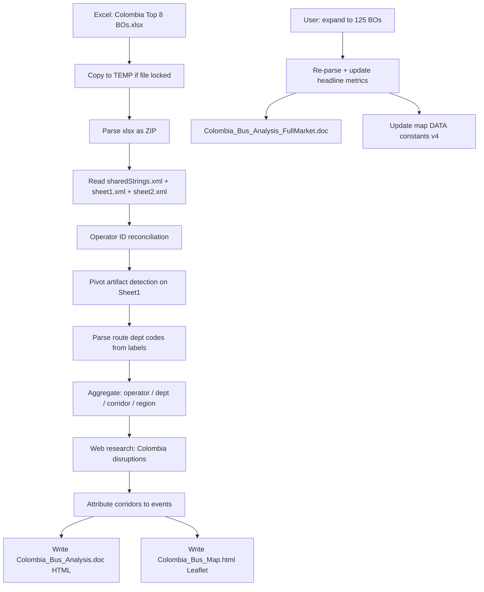

# Workflow — Colombia Top-8 / Full-Market BO Geographic Analysis

This document reconstructs **what was done** and **how it was done** in the original Claude session, so the work can be continued in Cursor or published on GitHub Pages.

---

## 1. Objective

Understand **where** redBus Colombia bus sales are growing or declining YoY for major operators, by:

- Matching operators across **system ID changes** between 2025 and 2026
- Aggregating **route-level** and **operator-level** transactions for **Mar–May** windows
- Grouping geography into **regions**, **departments**, and **corridors**
- Explaining moves with **natural, security, policy, and migration** events
- Delivering an **interactive map** and **Word-compatible narrative reports**

---

## 2. Inputs

| Input | Description |
|-------|-------------|
| `Colombia Top 8 BOs.xlsx` | Internal BO sales pivot; route + operator sheets |
| Comparison window | March, April, May — **2025 vs 2026** |
| Initial scope | Top 8 operators by volume |
| Expanded scope | All **125** active operators (same file, updated pivot) |

**Sheet layout (discovered via ZIP/XML parse, not Excel COM):**

| Sheet | Role |
|-------|------|
| **Sheet1** | Route-level rows: operator, route name, monthly txn columns |
| **Sheet2** | Operator-level pivot summary |
| **sharedStrings** | Route labels: `CityA (DeptA)-CityB (DeptB)` |

**Sheet1 column mapping (Mar–May txn columns):**

| Period | Columns |
|--------|---------|
| 2025 | D = Mar, F = Apr, H = May |
| 2026 | J = Mar, L = Apr, N = May |

---

## 3. End-to-end pipeline

---

## 4. Step-by-step (what was done)

### Phase A — Ingest & reconcile (prompt 1)

**User ask:** Match operator names; IDs may have changed YoY.

**How:**

1. Attempted Excel COM → user rejected / file locked.
2. **Workaround:** `Copy-Item` workbook to `%TEMP%\ColombiaBO_temp.xlsx`.
3. Opened as ZIP; read `xl/sharedStrings.xml`, `xl/worksheets/sheet1.xml`, `xl/worksheets/sheet2.xml`.
4. Built string index from `<si>` shared string entries.
5. Parsed sheet cells (`<c r="..." t="s"><v>index</v>`) into tabular rows.

**Operator ID reconciliation (mandatory):**

| Operator | Old ID (2025) | New ID (2026) |
|----------|---------------|---------------|
| Bolivariano | 20982 | 31571 |
| Arauca (regional) | 23180 | 33571 |
| Rápido Ochoa | 15612 | 33594 |

**Rule:** Exclude old IDs from operator-level totals when new IDs carry 2026-only rows — avoids double-counting.

---

### Phase B — Geographic patterns (prompt 2)

**User ask:** Where are we doing good vs bad geographically?

**How:**

1. Parsed department codes from route strings, e.g. `Medellin (Ant)-Ibague (Tol)` → origin dept **Ant**, destination **Tol**.
2. Aggregated transactions by **origin department** (and later by **corridor pairs**).
3. Computed YoY % and absolute deltas.

**First-pass error (important lesson):**

- XML column regex mis-assigned cells → showed **−28% market** and wrong per-operator stats.
- **User correction:** Bolivariano ~**−2%** (later refined to **−8.9%** on sheet2), market ~**flat (+0.5% top-8)**.
- Fix: use **Sheet2 pivot totals** for operator headlines; validate route-level separately.

---

### Phase C — Regional cohorts (prompt 3)

**User ask:** Add N/S/E/W regions, territories, departments.

**How:**

Defined **analytic regions** (not only compass quadrants):

| Region | Example departments |
|--------|---------------------|
| Bogotá Capital | Bogotá D.C. |
| Andean | Antioquia, Tolima, Santander, Boyacá, Cundinamarca |
| Eje Cafetero | Risaralda, Caldas, Quindío |
| Caribbean | Magdalena, Atlántico, Bolívar, Cesar, Sucre, Córdoba, La Guajira |
| Pacific | Valle del Cauca, Cauca, Chocó, Nariño |
| Llanos / East | Meta, Casanare, Arauca |
| Amazon | Caquetá, Putumayo |
| Andean NE Border | Norte de Santander |

Each region section in the report: narrative + department table + **largest routes** (added in a later prompt).

---

### Phase D — Disruption attribution (prompt 4)

**User ask:** Link geographic wins/losses to natural/political disruptions.

**How:**

1. Web search / news monitoring for Colombia Mar–May 2026 window (and carry-over events from 2025).
2. Catalogued **9 disruption events** with type tags:
   - **Natural** — La Niña Caribbean floods, Copacabana landslides
   - **Security** — FARC-EMC, ELN, Catatumbo, Meta/Llanos
   - **Policy** — Autopistas del Café concession reversal + toll hike
   - **Migration** — Venezuelan border crossings via Cúcuta
3. Mapped each **top corridor** Δ to a `cause` string and `causeType` used in map popups.

---

### Phase E — Interactive map (prompts 5–7)

**User ask:** Plot on Colombia map; fix rendering; replace broken emojis.

**How:**

1. Built **`Colombia_Bus_Map.html`** with:
   - [Leaflet](https://leafletjs.com/) 1.9.4
   - Department choropleth (public Colombia GeoJSON)
   - Curved **corridor polylines** (green solid = growth, red dashed = decline)
   - **Disruption markers** — switched from emoji pins to **colored SVG badges** (conflict / policy / natural) when emojis failed to render
2. Embedded constants: `DEPTS`, `CORRIDORS`, `DISRUPTIONS` in `<script>`.
3. Sidebar: layer toggles, top growing/declining lists, disruption list.
4. Iterated UI (Inter font, redBus header, stat pills).

**Deliverable path (original):** `Downloads\Colombia_Bus_Map.html`  
**Repo copy:** `docs/map.html`

---

### Phase F — Word report (prompt 8)

**User ask:** Full geographical analysis in doc format.

**How:**

- Wrote **Word-openable HTML** (`.doc` extension, MIME for Word):
  - `Colombia_Bus_Analysis.doc` — top-8 era narrative
- Sections: Executive summary, regional performance, department table, corridors, disruptions, findings, recommendations, appendix.

**Repo copies:**

- Top 8: `docs/report-top8-operators.html`
- Full market: `docs/report-full-market.html`

---

### Phase G — Full market rerun (prompt 9+)

**User ask:** Sheet now has **all BOs**, not only top 8.

**How:**

1. Re-parsed expanded workbook (~4,105 route rows → **2,448** clean routes).
2. **Pivot artifact rule:** if `D == F == H` and `D > 0`, treat 2025 months as invalid (pivot copied 2026 Mar into 2025 columns) → **1,679 rows removed**.
3. Updated headlines:
   - Operator-level: **−0.9%**, 116,482 → 115,481
   - Route-level: **−2.5%** (includes exited operators’ 2025-only routes)
4. Produced `Colombia_Bus_Analysis_FullMarket.doc` and refreshed map to **125 operators** (`DEPTS` / `CORRIDORS` data v4).
5. Added **top-8 vs full-market delta** section (Nariño, Chocó, Quindío, Medellín–Armenia −64%).

---

### Phase H — Report enrichment (final prompt)

**User ask:** For top-8 report, add biggest routes per region + region descriptions.

**How:** Extended regional sections with route tables and prose; synced map popup copy where needed.

---

## 5. Tools & environment

| Tool | Use |
|------|-----|
| **Claude CLI** (Sonnet 4.6) | Orchestration, analysis, HTML generation |
| **PowerShell** | File copy, ZIP parse, regex extraction |
| **Excel** | Source pivot only (often locked — parse via ZIP) |
| **Leaflet + CDN GeoJSON** | Map visualization |
| **No Tequila/SQL** | Pure internal Excel sales export |

---

## 6. Outputs catalog

| File | Scope | In repo |
|------|-------|---------|
| `Colombia_Bus_Map.html` | Interactive map | `docs/map.html` |
| `Colombia_Bus_Analysis.doc` | Top-8 written report | `docs/report-top8-operators.html` |
| `Colombia_Bus_Analysis_FullMarket.doc` | 125-BO report + appendix | `docs/report-full-market.html` |
| Claude file-history snapshots | Versioned HTML backups | `reports/html/map-top8-v2-archive.html` |

---

## 7. Quality checks applied

1. **Cross-check** operator totals (Sheet2) vs route sums (Sheet1) — aim for &lt;1% gap after ID fix.
2. **User challenge** on Bolivariano and headline YoY — triggered parser fix.
3. **Artifact scan** before corridor ranking — prevents false “collapsed” 2025 routes.
4. **Top-8 vs 125** sensitivity table for security-affected departments.

---

## 8. Re-running in Cursor

Suggested agent prompts (see [`PROMPTS.md`](PROMPTS.md)):

1. Place/update xlsx under `data/` (see `data/README.md`).
2. Run or adapt `scripts/parse_colombia_bo_xlsx.ps1` to emit CSV summaries.
3. Recompute `DEPTS` / `CORRIDORS` JSON and patch `docs/map.html`.
4. Regenerate report HTML from templates in `docs/report-full-market.html`.

Optional: add a Cursor skill under `.cursor/skills/colombia-bo-geographic-analysis/` pointing to this folder (same pattern as `lmrd-tequila-trigger-metrics`).

---

## 9. Known limitations

- **Confidential data** — do not commit the raw xlsx.
- **Origin-based department YoY** — corridors are directional; round-trip effects may need paired logic.
- **Disruption attribution** is qualitative news linking, not causal inference.
- **Map coordinates** are department centroids — not exact highway paths.
- **Mar–May only** — not full-year seasonality.

---

## 10. Contact / ownership

Original analysis: **Raghava Goel**, redBus Intelligence, May 2026.  
Extend via GitHub issues/PRs on the published repo.
